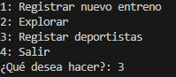
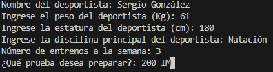
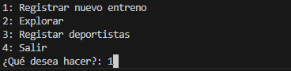
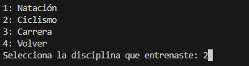
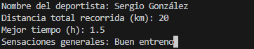

# Thundersports
Thundersports es un programa ideado para el seguimiento y control de tus entrenos deportivos. Aquí podrás registrar entrenos de natación, ciclismo y carrera (pruebas de triatlón), con estos registros podrás comparar tus avances y la mejora con el paso del tiempo.

## ¿Cómo usarlo?
Thundersports te proporciona 3 opciones base. Registrar entrenos, registrar deportistas y explorar.
Al registrar entrenos podemos hacerlo en las 3 disciplinas mencionadas previamente, cada una tiene cierto enfoque, por lo que hay ligeras diferencias entre ellas.
La idea principal es registrar el deportista que realizó ese entreno, el programa asigna la fecha, se ingresa la distancia total recorrida en el entreno, la prueba específica que se entrenó, el mejor tiempo en el que se hizo esta y las sensaciones generales del entreno.

Para registrar deportistas se deben llenar los datos básicos, estos servirán de referencia para medir los cambios que tenga el deportista. Nombre, peso, estatura, disciplina principal, prueba en la que se piensa enfocar y el numero de veces que piensa entrenar son los datos que se deben llenar en este apartado. 

Al explorar, lo que hacemos es ver todos los entrenos de natación, ciclismo, carrera ó los deportistas registrados en un mismo lugar, acá podemos comparar el entreno con mayor distancia recorrida en la disciplina que estemos explorando.

## ¿Cómo acceder al programa?
Tener acceso al programa es muy simple, para esto solo tenemos que clonar un repositorio con Git. Accedemos al link del repositorio desde Git Hub en el navegador de nuestra computadora y lo copiamos, clonamos el repositorio a nuestro Git Bash local pegando el link con el comando "git clone". Con estos pasos hechos, solo queda ejecutar el programa llamado "Thundersports.py" en alguna consola, como vs code.

## Ejemplo de uso
Desea registrar a un nuevo deportista:

Desea incribir un nuevo entreno de ciclismo:

